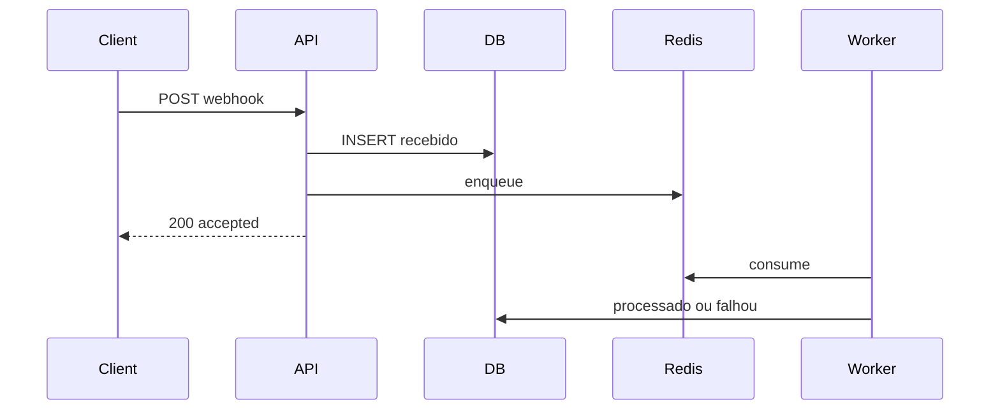

# RotaPay

Projeto que eu montei pra treinar um TMS simples no contexto BR: frete com papéis (admin, embarcador, motorista), mapa no OpenStreetMap e Pix só depois que a carga foi entregue.

A ideia é bem direta. Embarcador cria o frete, motorista aceita e atualiza o status, e o pagamento só entra quando chega em **entregue**. Eu não finjo TED pra CPF no sandbox: o sistema gera o Pix, confirma no webhook e grava o repasse líquido do motorista no banco.

## Stack

- Front: React, TypeScript, Vite, Leaflet
- API: Python, FastAPI, SQLAlchemy, Alembic
- Banco: PostgreSQL 16 + Redis 7
- Fila: RQ (worker separado para webhook de Pix)
- Auth: JWT em cookie httpOnly (nada de localStorage)
- Pix: Mercado Pago sandbox, ou modo demo se não tiver token

Valores em centavos (`int`), tela em `R$ 1.234,56`, datas `DD/MM/AAAA`, fuso `America/Sao_Paulo`. Soft delete com `created_at`, `updated_at`, `deleted_at`.

Status:

`cotado → aceito → em_transito → entregue → pago` (e `cancelado` com regra)

No aceite do motorista eu calculo o SLA pela distância (Haversine), com média 45 km/h, buffer 1,5x, mínimo 72h e máximo 14 dias.

## Decisões e trade-offs

### Por que fila no webhook
Mercado Pago (e o botão demo) pode reenviar o mesmo evento. Se eu processar regra de negócio dentro do `POST`, a API fica lenta e qualquer timeout do provedor vira reenvio bagunçado. O endpoint só valida, **persiste o evento cru** e **enfileira** no Redis (RQ). O worker aplica o domínio (aprovar payment, frete → `pago`). Assim o HTTP responde rápido e o efeito fica no worker, com retry.

### Idempotência
Cada evento tem `event_key` único (`tipo:payment_id:action`). Duplicata no insert vira `duplicate: true` e não enfileira de novo. O worker também ignora evento já `processado`.

### Pix demo vs Mercado Pago
Sem `MP_ACCESS_TOKEN`, gero Pix demo e o detalhe tem “Simular webhook”. Com token, uso a API do MP de verdade. Nos dois casos o caminho é o mesmo: webhook → fila → worker.

### O que o sistema não faz
Não faz TED/payout automático pra CPF do motorista. Só registra `driver_payout_recorded_cents` como repasse líquido no banco. Sandbox não é banco real.

### Falha visível
Depois das retries (5), o evento fica `falhou` com `last_error`. Admin consulta:

```bash
# login como admin@rotapay.com, cookie httpOnly
curl -b cookies.txt 'http://localhost:8000/api/admin/webhook-events?status=falhou'
curl -b cookies.txt 'http://localhost:8000/api/admin/webhook-events/stats'
```

Se o Redis estiver fora no accept, a API devolve **503** e o evento permanece `recebido` (não minto 200 sem fila).



## Pix (fluxo)

- Só gera Pix com frete **entregue**
- Webhook idempotente + rate limit
- Guardo `driver_payout_recorded_cents` como repasse líquido
- Sem `MP_ACCESS_TOKEN`, roda em demo; o front espera o worker antes de mostrar `pago`

## Como eu testo o fluxo

1. Entro como `embarcador@rotapay.com` / `senha123` e crio um frete com CEP BR
2. Saio e entro como `motorista@rotapay.com` / `senha123`
3. Aceito → inicio trânsito → marco entregue
4. Volto no embarcador, gero o Pix e copio o código / QR
5. Simulo o webhook (demo), com o **worker rodando**, e vejo o frete ir pra **pago**

Tem seed também com `admin@rotapay.com`. Senha de todos: `senha123`.

## Subir local

Três terminais (infra + API + worker). Sem o worker o Pix demo não fecha.

```bash
cp .env.example .env
docker compose up -d
# Postgres na 5434, Redis na 6381

cd backend
python -m venv .venv && source .venv/bin/activate
pip install -r requirements.txt
alembic upgrade head
python -m app.seed
uvicorn app.main:app --reload --port 8000
```

```bash
# outro terminal — worker RQ
cd backend && source .venv/bin/activate
rq worker rotapay-webhooks --url redis://localhost:6381/0
```

```bash
cd frontend
npm install && npm run dev
```

- App: http://localhost:5173
- Health: http://localhost:8000/api/health (checa app, Postgres e Redis)
- Docs da API: http://localhost:8000/docs

## Testes

```bash
cd backend && source .venv/bin/activate && pytest -q
```

Cobrem máquina de status, SLA, accept/apply do webhook, e o fluxo de API frete → Pix → pago (com idempotência, 403 e 409). CI sobe Postgres + Redis.

## Prints

Deixei uns prints em [`docs/prints/`](docs/prints/) (login, lista, detalhe, dashboard e Pix).

Uso só pra estudo / demonstração.
